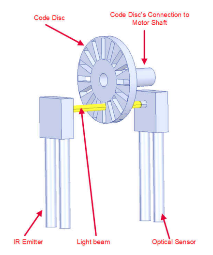
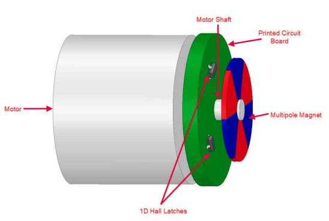

Precise, stable motion is at the heart of effective robotic systems, and that precision begins at the motor level. In this post, we explore the building blocks of low-level control: from how motors are sensed and driven to the algorithms that govern their behavior. This is essential knowledge for anyone building robots that must interact precisely and robustly with the real world.

---

## Content Outline

1. Why Low-Level Control Matters
2. Encoders: Measuring Motion Accurately
   - Types and technologies
   - Suppliers and key specs
3. Motor Drivers: Bridging Logic and Power
   - Architectures and examples
4. Control Loops and Strategies
   - PID, FOC, cascaded control
5. Hardware Implementation and Firmware
   - Microcontrollers, RTOS, DMA
6. ROS Integration and Real-Time Interfaces
7. Expanded Section: Diagrams, Tables, and Code
8. Open Source Motor Control Projects

---

## Why Low-Level Control Matters

Low-level motor control translates high-level motion goals (like "move forward 5 cm") into accurate voltage, current, and timing signals. This is the foundation of robotic movement, ensuring stability, safety, and performance even in the presence of mechanical and electrical nonlinearities.

---

## 1. Encoders: Measuring Motion Accurately

### a. What Encoders Do
Encoders are sensors that convert the position or speed of a rotating shaft into electrical signals. These signals are fed back into control loops to ensure motors reach the desired position or velocity.

### b. Types of Encoders
- **Incremental Encoders**: Generate a fixed number of pulses per revolution. Require an external reference point (index pulse) to determine absolute position.

- **Absolute Encoders**: Each position has a unique code. Do not require homing.
- **Linear Encoders**: Used in translational applications.

### c. Encoder Technologies
- **Optical Encoders**: Use a disk with transparent/opaque segments. High resolution but sensitive to dust.
Optical Incremental Encoder [Mekre 2022]


- **Magnetic Encoders**: Use Hall effect or magnetoresistive sensors. More robust but often lower resolution.
Magnetic Incremental Encoder [Mekre 2022]

- **Capacitive Encoders**: Emerging technology, low power, high noise immunity.
Capacitive Encoder 

### d. Key Specifications
- **CPR/PPR (Counts or Pulses per Revolution)**: Determines angular resolution.
- **Latency**: Affects responsiveness. Lower is better.
- **Interface**: Common interfaces include:
  - Quadrature ABZ signals
  - PWM
  - Digital SPI/I2C
  - Analog output (sin/cos)

### e. Leading Suppliers
- [US Digital](https://www.usdigital.com/): High-resolution optical encoders
- [CUI Devices](https://www.cuidevices.com/): Magnetic and optical encoders for robotics
- [Broadcom](https://www.broadcom.com/products/motion-control-encoders/): Industrial-grade encoders

<!-- ### 📊 Encoder Comparison Table

| Supplier       | Type         | Technology | Max CPR | Interface       |
|----------------|--------------|------------|---------|-----------------|
| US Digital     | Incremental  | Optical    | 10,000  | ABZ, SPI        |
| CUI Devices    | Absolute     | Magnetic   | 16-bit  | PWM, I2C, SPI   |
| Broadcom       | Incremental  | Optical    | 5000    | ABZ             | -->

---

## 2. Motor Drivers: Bridging Logic and Power

### a. What Motor Drivers Do
Motor drivers act as power amplifiers. They receive low-power control signals and use them to switch high currents that drive the motor windings. They also often handle safety features and current feedback.

### b. Motor Driver Architectures
- **H-Bridge** (for Brushed DC motors): Four FETs switching current direction
- **Three-Phase Inverters** (for BLDC/PMSM motors): Six FETs in three half-bridges
- **Half-Bridge or Full-Bridge Drivers**: For high-torque actuators


### c. Key Motor Driver Features
- **PWM Support**: Adjustable frequency, dead time insertion
- **Current Sensing**: Integrated or external shunt resistors/Hall sensors
- **Protection Features**: Over-voltage, under-voltage, over-temperature, short-circuit
- **Commutation Support**: Trapezoidal (six-step), sinusoidal, or FOC

### d. Notable Driver ICs and Boards
- **Texas Instruments DRV8313/DRV8323**: For 3-phase BLDC motors
- **STMicroelectronics L6234**: Three-phase brushless driver
- **Infineon TLE9180D**: For high-power automotive and robotics
- **Open Source Boards**:
  - [ODrive](https://odriverobotics.com/): High-performance open-source BLDC control
  - [VESC](https://vesc-project.com/): Versatile ESC for BLDC motors
  - [SimpleFOC Shield](https://simplefoc.com/): Low-cost Arduino-compatible FOC board

---

## 3. Control Loops and Strategies

### a. Cascaded Control Architecture
Motor control often uses a nested loop structure:
1. **Current Loop**: Fastest loop (~10–30 kHz). Controls torque.
2. **Velocity Loop**: Intermediate loop (~1 kHz). Controls motor speed.
3. **Position Loop**: Slowest loop (~100–500 Hz). Controls shaft position.

```
Desired Pos → [Pos PID] → Desired Vel → [Vel PID] → Desired Curr → [Curr PID] → PWM to driver
```

### b. PID Control
The PID controller is a feedback control loop:

$$
u(t) = K_p e(t) + K_i \int_0^t e(\tau) d\tau + K_d \frac{de(t)}{dt}
$$

Where:
- $e(t)$ = error (reference - measured value)
- $K_p, K_i, K_d$ = proportional, integral, and derivative gains

**Tuning** is essential. Ziegler-Nichols and model-based tuning are common.

### c. Feedforward Augmentation
Feedforward terms (like gravity compensation, friction models) are added to improve response and reduce reliance on feedback.

### d. Field-Oriented Control (FOC)
Also known as vector control, FOC is the gold standard for BLDC and PMSM motors:
- Controls current in a rotating d-q frame
- Uses Clarke and Park transforms to decouple torque and flux components

**Equations:**
- Clarke transform:
  $$
  \begin{align*}
  \alpha &= a \\
  \beta &= \frac{1}{\sqrt{3}}(b - c)
  \end{align*}
  $$
- Park transform:
  $$
  \begin{align*}
  d &= \alpha \cos(\theta) + \beta \sin(\theta) \\
  q &= -\alpha \sin(\theta) + \beta \cos(\theta)
  \end{align*}
  $$

### e. Quasi-Direct Drive Motors
These use low-ratio gearboxes (e.g., cycloidal or harmonic) with high-torque-density motors:
- Pros: High backdrivability, low impedance, good for dynamic tasks
- Paired with FOC for compliance control
- Used in exoskeletons and legged robots

Example: [MIT Mini Cheetah](https://www.youtube.com/watch?v=x8jKDYvZLLo)

---

## 4. Hardware Implementation and Firmware

### a. Microcontrollers
- **STM32** (ARM Cortex-M): Real-time performance, flexible peripherals
- **TI C2000**: Optimized for motor control
- **ESP32**: Great for low-cost, Wi-Fi-enabled applications

### b. Real-Time Operating Systems (RTOS)
- **FreeRTOS**: Task-based structure
- **Zephyr RTOS**: Scalable, ROS2-ready
- **ChibiOS**: Lightweight, fast context switch

### c. Control Loop Integration
- ISR (interrupt service routines) for PWM, ADC
- Use DMA to offload CPU
- Timer-triggered sampling for deterministic control

### d. Firmware Libraries and Tools
- [STM32CubeMX](https://www.st.com/en/development-tools/stm32cubemx.html): Peripheral config
- [TI MotorWare](https://www.ti.com/tool/MOTORWARE): InstaSPIN and FOC libs
- [SimpleFOC](https://docs.simplefoc.com/): Arduino-style interface

---

## 5. ROS Integration and Real-Time Interfaces

Low-level motor control is often integrated with higher layers like ROS:
- Use `ros2_control` and `hardware_interface` for abstraction
- Real-time communication via DDS (e.g., FastDDS, CycloneDDS)
- Microcontroller-level ROS using [micro-ROS](https://micro.ros.org/)

**Best Practices:**
- Separate real-time and non-real-time tasks
- Protect low-level loops from jitter caused by non-deterministic behavior

---

## 6. Open Source Motor Control Projects

Here are some notable open-source projects on GitHub for motor control:

### VESC Project
- **Repository**: [vedderb/bldc](https://github.com/vedderb/bldc)
- **Description**: The Vienna BLDC/FOC motor controller, featuring high-performance FOC control
- **Key Features**:
  - Field Oriented Control (FOC)
  - Support for various motor types (BLDC, PMSM)
  - Regenerative braking
  - Highly configurable through VESC Tool

### ODrive
- **Repository**: [odriverobotics/ODrive](https://github.com/odriverobotics/ODrive)
- **Description**: High-performance motor control for robotics
- **Key Features**:
  - Position, velocity, and torque control
  - Python and C++ APIs
  - Works with most brushless motors
  - Built-in trajectory planning

### SimpleFOC
- **Repository**: [simplefoc/Arduino-FOC](https://github.com/simplefoc/Arduino-FOC)
- **Description**: Arduino-compatible FOC motor control library
- **Key Features**:
  - Easy to use with Arduino ecosystem
  - Support for various MCUs
  - Comprehensive documentation
  - Great for learning and prototyping

### MicroMod Motor Control
- **Repository**: [sparkfun/MicroMod_Motor_Driver](https://github.com/sparkfun/MicroMod_Motor_Driver)
- **Description**: SparkFun's modular motor control system
- **Key Features**:
  - Multiple motor driver options
  - Modular design
  - Arduino-compatible
  - Good for educational purposes

### Trinamic Motion Control
- **Repository**: [trinamic/TMC-API](https://github.com/trinamic/TMC-API)
- **Description**: API for Trinamic's motor drivers
- **Key Features**:
  - StealthChop quiet motion
  - Advanced current control
  - Stallguard sensorless homing
  - Industry-grade components

These projects provide different approaches to motor control, from high-performance industrial applications to educational platforms. They're excellent resources for both learning and implementing motor control systems.

---

## Conclusion

Mastering low-level motor control gives you the tools to build smooth, efficient, and safe robotic systems. Whether you're designing quadrupeds, manipulators, or mobile robots, this layer is critical.

With careful component selection, precise sensing, and robust control strategies like FOC and PID, robotic motion can become as natural and adaptive as needed.

---

## 🔗 Further Reading & Tools
- [ODrive Motor Control](https://odriverobotics.com/)
- [SimpleFOC Documentation](https://docs.simplefoc.com/)
- [ST Motor Control SDK](https://www.st.com/en/ecosystems/st-motor-control-sdk.html)
- [TI InstaSPIN](https://www.ti.com/tool/INSTASPINUNIVERSAL)
- [Field-Oriented Control – MathWorks Guide](https://www.mathworks.com/help/mcb/ug/field-oriented-control-foc.html)
- [VESC Tool](https://vesc-project.com/)

---

## References

1. Mekre, M., Isaac, L. [*Differences Between Optical and Magnetic Incremental
Encoders*](https://www.ti.com/lit/ab/slya061/slya061.pdf?ts=1745231395555) TI, 2022.

---